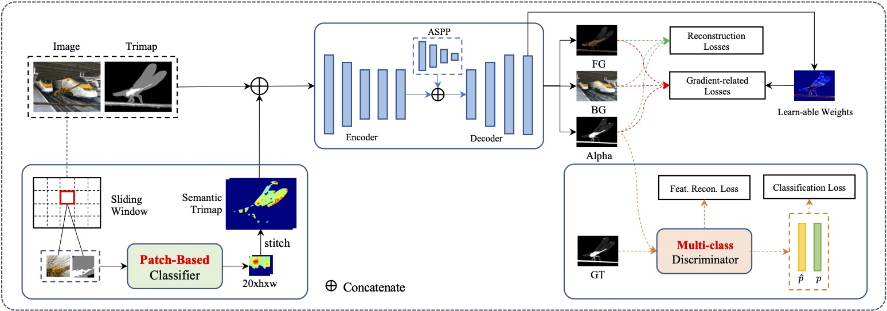
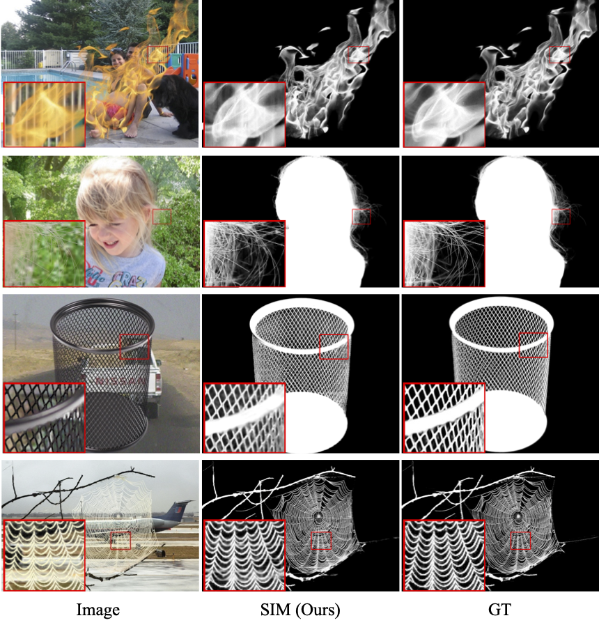

# Semantic Image Matting [Under construction]
---
This is the official repository of Semantic Image Matting (CVPR2021). Dataset, code and model will be released soon.

### Overview

Natural image matting separates the foreground from background in fractional occupancy which can be caused by highly transparent objects, complex foreground (e.g., net or tree), and/or objects containing very fine details (e.g., hairs). Although conventional matting formulation can be applied to all of the above cases, no previous work has attempted to reason the underlying causes of matting due to various foreground semantics.

We show how to obtain better alpha mattes by incorporating into our framework semantic classification of matting regions. Specifically, we consider and learn 20 classes of matting patterns, and propose to extend the conventional trimap to semantic trimap. The proposed semantic trimap can be obtained automatically through patch structure analysis within trimap regions. Meanwhile, we learn a multi-class discriminator to regularize the alpha prediction at semantic level, and content-sensitive weights to balance different regularization losses. 

### Dataset
TBD

### Run
TBD

### Results

